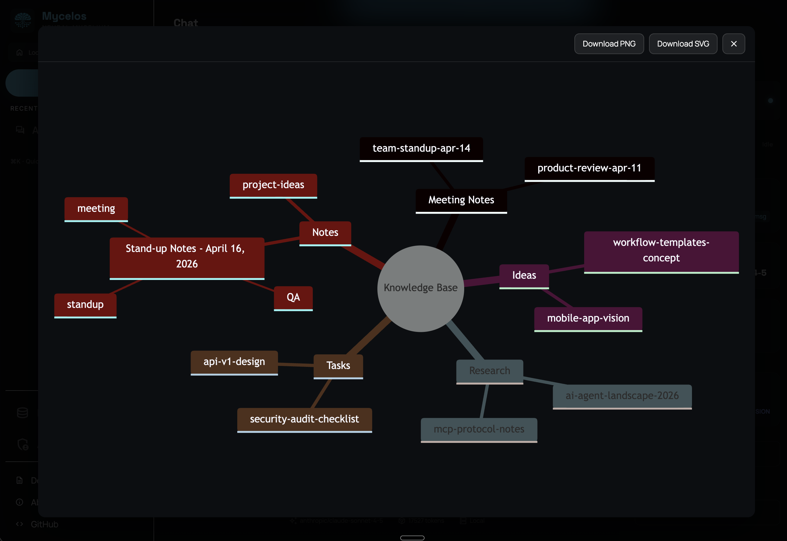
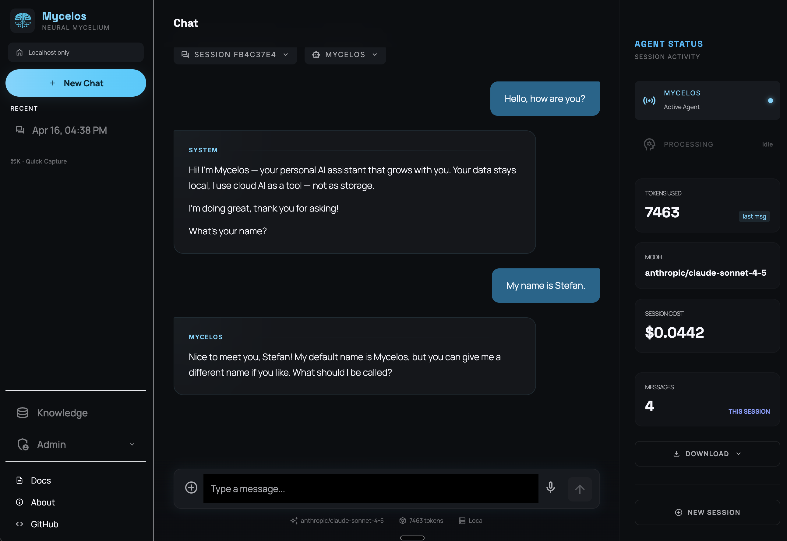
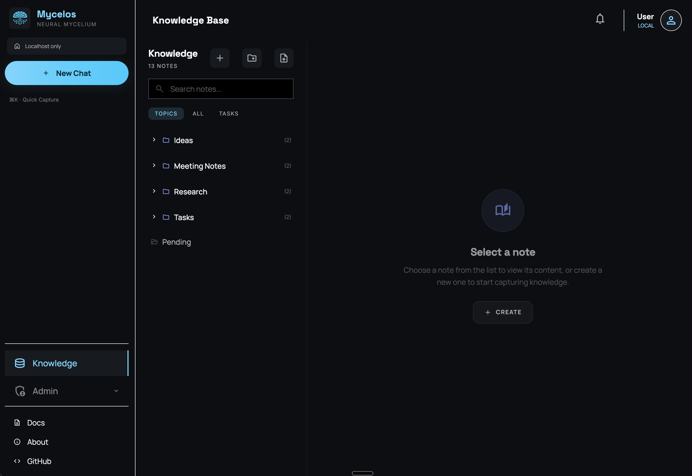
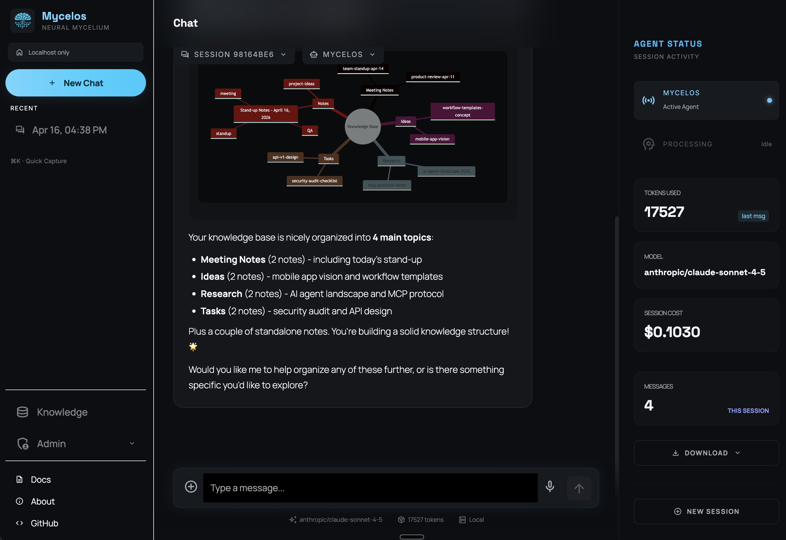
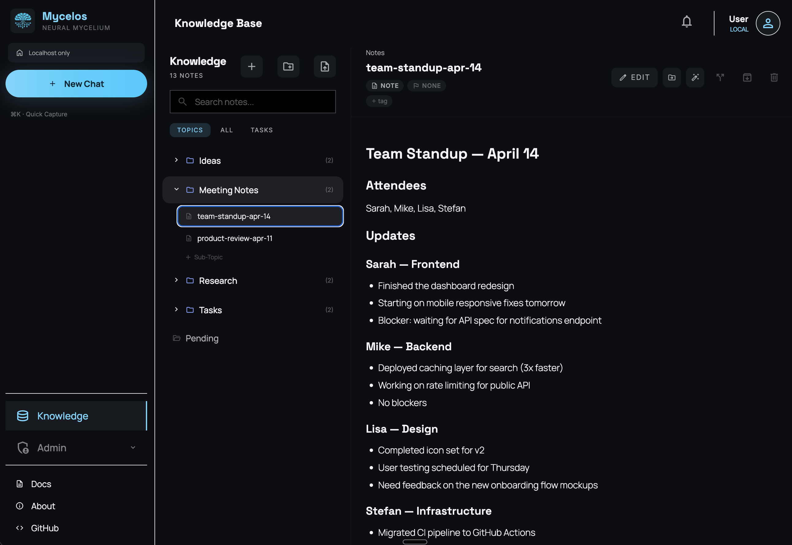
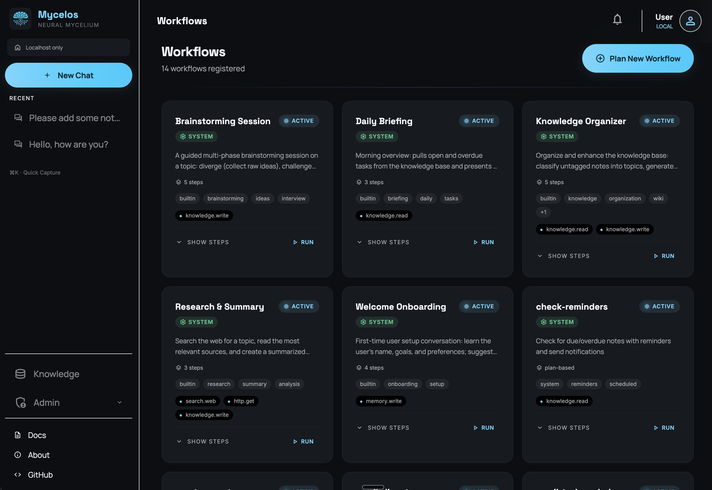
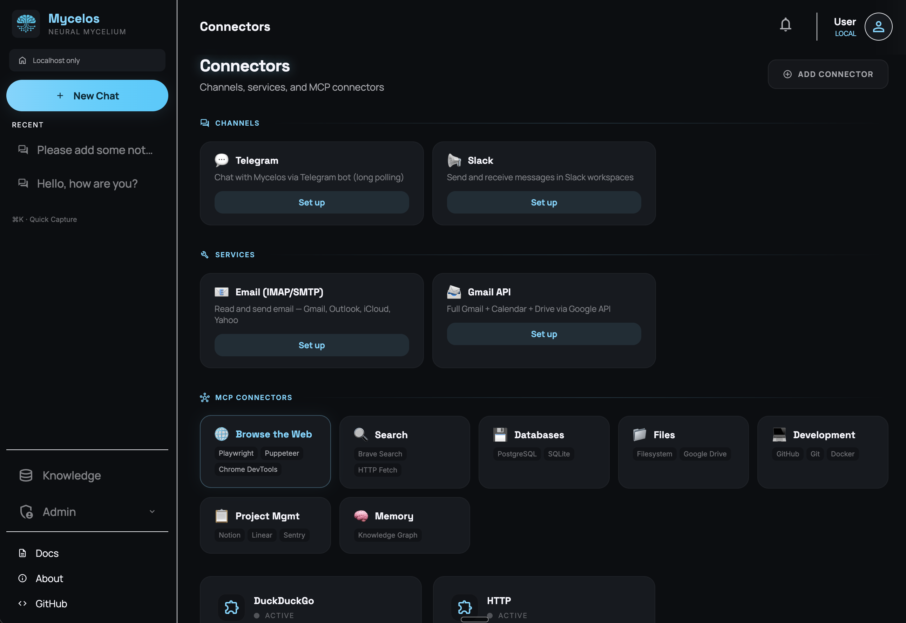
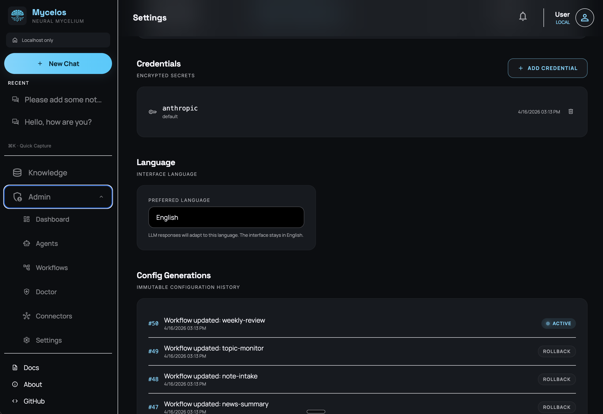
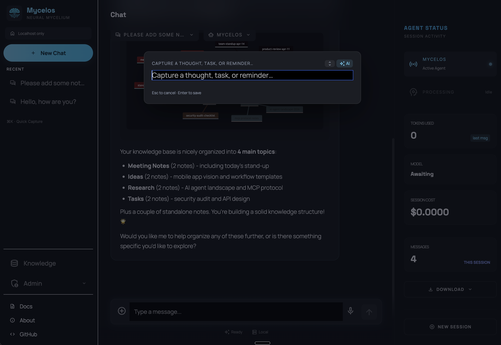

# Mycelos — The AI That Grows With You

  

A self-hosted, security-first agent operating system. Your data stays local, cloud LLMs are tools — not your storage.

<p align="center">
  
</p>

---

## What is Mycelos?

Mycelos is a personal AI assistant that starts with a single chat interface and grows as you use it. It organizes your knowledge, manages your tasks, connects to your services, and learns your preferences — all while keeping your data on your machine.

Unlike hosted AI services, Mycelos runs locally. Unlike other agent frameworks, it treats security as a first-class concern: credentials never touch the LLM, every configuration change creates an immutable snapshot you can roll back, and every state mutation is logged to an audit trail.

## Vision

The idea behind Mycelos is simple: **use the big models to build your system, use small models to run it.**

Today's frontier models get better every day. Mycelos lets you harness that power to extend your personal system — create agents, build workflows, connect services. But your day-to-day operations (organizing notes, sending reminders, searching your knowledge) can run on smaller, cheaper, or even local models with full privacy.

**Security was a design decision, not an afterthought.** All credentials are encrypted at rest. Every outbound request goes through a Security Proxy that can be monitored and controlled. Agents never see raw API keys. Every state change is auditable and reversible.

We know Mycelos is still early. There are areas to improve — sandbox isolation, multi-user support, more connectors. We're releasing it now because we believe in building in the open and finding others who share this vision. If you're excited about a personal AI that you own and control, we'd love your contributions.

---

## Quick Start

### With Docker (recommended)

```bash
# Download the compose file
curl -O https://raw.githubusercontent.com/mycelos-ai/mycelos/main/docker-compose.yml

# Start Mycelos
docker compose up -d
```

That's it. Open `http://localhost:9100` in your browser. Mycelos will ask for your API key on first use and store it encrypted.

Pre-built images are available for **AMD64** and **ARM64** (Raspberry Pi, Apple Silicon) via GitHub Container Registry.

### Build from source (alternative)

```bash
git clone https://github.com/mycelos-ai/mycelos
cd mycelos
docker compose build
docker compose up -d
```

### Network access & security

The Docker image binds to `0.0.0.0` so it's reachable from other devices on your network. That's convenient, but also means **anyone on your network can access Mycelos** unless you protect it.

**Recommended:** Enable Basic Auth by setting a password in `.env`:

```bash
# .env
MYCELOS_PASSWORD=your-strong-password-here
```

Then restart: `docker compose up -d`. The web UI will prompt for your browser's Basic Auth dialog.

**Alternative:** If you only want local access, change the port mapping in `docker-compose.yml`:

```yaml
ports:
  - "127.0.0.1:9100:9100"   # Only reachable from the host itself
```

### With pip

```bash
pip install mycelos
mycelos init          # Setup: database, encryption key, LLM provider
mycelos serve         # Start the web interface at http://localhost:9100
```

For terminal-only use:

```bash
mycelos chat          # Interactive CLI session
```

---

## Screenshots

| Chat | Knowledge Base |
|:---:|:---:|
|  |  |
| Conversational AI with real-time cost tracking | Notes auto-organized into topics |

| Knowledge Graph | Note Detail |
|:---:|:---:|
|  |  |
| Visualize your knowledge as an interactive graph | Full Markdown rendering with metadata |

| Workflows | Connectors |
|:---:|:---:|
|  |  |
| 14 built-in workflows with one-click execution | Telegram, Slack, Email, GitHub, and MCP connectors |

| Settings | Quick Capture |
|:---:|:---:|
|  |  |
| Encrypted credentials, config generations with rollback | Cmd+K to capture thoughts without leaving your view |

---

## Features

### Knowledge Base
- **Notes, tasks, and reminders** — capture anything, Mycelos auto-organizes into topics
- **Quick Capture** (Cmd+K in the web UI) — jot down ideas without leaving your current view
- **Semantic search** across all your notes
- **Auto-filing** — Mycelos learns your preferences and files notes automatically
- **Reminders** — set time-based or location-based reminders on any note

### Web Interface
A full browser-based UI served by `mycelos serve`:
- **Chat** — conversational interface with voice input, file upload, and rich widgets
- **Knowledge** — browse, search, and organize your notes and topics
- **Agents** — view, rename, and manage your AI agents
- **Workflows** — create and monitor automated task pipelines
- **Connectors** — set up Telegram, GitHub, Email, and other integrations
- **Dashboard** — overview of your system status

### AI & Chat
- Multi-provider LLM access via LiteLLM (Anthropic, OpenAI, Gemini, Ollama, OpenRouter)
- Per-agent model assignments with priority-based failover
- Intent classification and automatic handoff to specialist agents
- **Level-driven onboarding** — Mycelos adapts its behavior to your experience level
- **Slash commands** — type `/help` in chat to see all available commands

### Security
- AES-256-GCM encrypted credentials — keys never appear in logs, prompts, or tracebacks
- Credential Proxy: the LLM broker injects the needed key per-call, then clears it
- Capability tokens with prefix scoping: `github.read` grants `github.read.*` but not `github.write`
- Policy engine with property-based invariants
- Response sanitizer strips credentials from LLM output
- **Fail-closed** — unknown agent = denied, capability error = denied, no fallback to "allow"

### Connectors (MCP)
- Built on the **Model Context Protocol** — access to thousands of community connectors
- GitHub, Filesystem, Web Search, Email — out of the box
- Any MCP-compatible server: `/connector add-custom <name> <command>`
- Credentials injected by SecurityProxy — connectors never see raw keys

### Channels
- **Web** — browser UI with voice recording, file upload, permission widgets
- **Terminal** — Rich CLI with tab completion, markdown rendering
- **Telegram** — polling bot with voice messages, file upload, inline permission buttons
- FastAPI gateway with SSE streaming

### Automation
- Built-in workflows: brainstorming, research, daily briefing
- Workflow matching: Planner finds the right workflow via embedding search
- Cron scheduling via Huey + SqliteHuey (no Redis required)
- Budget control: pause workflow runs when cost limit is reached
- Background task execution with step tracking and notifications

---

## CLI Commands

```bash
mycelos init              # Initialize database and config
mycelos serve             # Start the web interface (default: port 9100)
mycelos chat              # Interactive terminal session
mycelos stop              # Stop the gateway
mycelos doctor            # Diagnose issues and suggest fixes
mycelos config list       # Show config generations
mycelos config rollback N # Roll back to generation N
mycelos connector list    # Show connected services
mycelos credential list   # Show stored credentials (names only, never values)
mycelos schedule list     # Show cron jobs
mycelos sessions          # List recent chat sessions
mycelos model             # Manage LLM models and assignments
mycelos demo              # Non-interactive feature walkthrough
mycelos reset             # Backup and start fresh
```

## Slash Commands (in Chat)

Type `/help` in any chat session to see all commands:

| Command | What it does |
|---------|-------------|
| `/help` | Show all available slash commands |
| `/memory` | List, search, or clear persistent memory |
| `/cost` | Usage & cost tracking (today, week, month) |
| `/sessions` | List and resume chat sessions |
| `/mount` | Manage filesystem access |
| `/config` | Show config, rollback generations |
| `/agent` | List agents, grant/revoke capabilities |
| `/connector` | Add, remove, test connectors |
| `/schedule` | Manage cron jobs |
| `/workflow` | List, show, run workflows |
| `/credential` | Manage encrypted credentials |
| `/model` | List configured LLM models |
| `/run` | Run a workflow |
| `/bg` | List and manage background tasks |
| `/reload` | Reload MCP connectors |
| `/restart` | Restart the system |

---

## Architecture

```
Channels          Web UI | Terminal (Rich) | Telegram
                       ↓
Control Layer     Mycelos Agent | Builder Agent | Workflow Agent
                       ↓
Execution Layer   Sandbox (subprocess) | Workflow Engine | Huey Scheduler
                       ↓
Security Layer    Credential Proxy | Capability Tokens | Policy Engine | Sanitizer
                       ↓
Storage Layer     SQLite WAL | Config Generations | Object Store | Knowledge Base
```

### Agent Creation Pipeline

When you describe a need, the Builder Agent follows a structured pipeline:

```
User describes need
  → Interview (clarify requirements)
  → Gherkin Scenarios (user confirms acceptance criteria)
  → pytest Tests (TDD — tests written before implementation)
  → Agent Code (must pass all tests)
  → Sandbox Execution (real pytest in isolated subprocess)
  → Security Audit (no dangerous imports, no credential leaks)
  → Registration (Object Store + DB + Config Generation)
```

Human confirmation is required at registration. This step is non-learnable and non-auto-approvable by design.

---

## Configuration

Mycelos uses NixOS-style immutable configuration generations. Every change (new connector, new agent, model switch, policy update) creates a new generation. Rollback is an O(1) pointer swap.

```bash
mycelos config list              # Show all generations
mycelos config show              # Show current state
mycelos config diff              # Compare two generations
mycelos config rollback [N]      # Roll back to generation N
```

---

## Development

### Setup

```bash
git clone https://github.com/mycelos-ai/mycelos
cd mycelos
pip install -e ".[dev]"
mycelos init
```

### Testing

```bash
pytest -v                         # Full test suite (2000+ tests)
pytest tests/security/ -v         # Security invariant tests (must never break)
pytest tests/test_config.py -v    # One module
pytest --tb=short                 # Short tracebacks
```

Security tests in `tests/security/` are treated as invariants. A failing security test is a blocking issue, not a warning.

### Contributing

See [CONTRIBUTING.md](CONTRIBUTING.md) for guidelines.

---

## Tech Stack

| Component | Technology |
|-----------|-----------|
| Language | Python 3.12+ |
| Database | SQLite (WAL mode) |
| HTTP Gateway | FastAPI + uvicorn |
| LLM Access | LiteLLM |
| Task Queue | Huey + SqliteHuey |
| Encryption | AES-256-GCM + HKDF (cryptography library) |
| Terminal UI | Rich |
| CLI | click |
| Testing | pytest + Hypothesis |
| External Services | MCP (Model Context Protocol) |

No LangChain. No LangGraph. No CrewAI. Own Protocol-based interfaces throughout.

---

## Project Structure

```
src/mycelos/
  agents/        System agents (Mycelos, Builder, Workflow Agent)
  channels/      Terminal, Telegram
  chat/          Conversation engine, slash commands, events
  cli/           CLI commands (click)
  config/        NixOS-style config generations
  connectors/    MCP-based connectors
  execution/     Sandbox, CLI runtime
  frontend/      Web UI (Alpine.js)
  gateway/       FastAPI HTTP gateway
  knowledge/     Knowledge base, topics, search
  llm/           LLM Broker (LiteLLM)
  memory/        Memory service (4 scopes)
  security/      Credential proxy, capabilities, policies
  storage/       SQLite backend
  workflows/     Workflow engine and built-in workflows
  audit.py       Audit logger
  app.py         Service container
  gamification.py Level system
  protocols.py   All service interfaces (Python Protocols)
```

---

## License

MIT — see [LICENSE](LICENSE).
